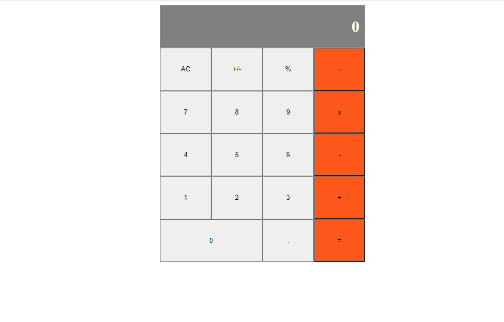

# React Templete

This is the first project of the Math Magicians application. We will set up the environment and tools needed to develop a React application.



## Built With 
- JavaScript
- React
- Webpack
- HTML/SCSS
- Node.JS
- Jest
- Cypress


## Getting Started

If you want a copy of this file go to the github repository and download it from there

- [React Template](https://github.com/Mhdez221993/react-template)

### Setup

```cmd
git clone  git@github.com:Mhdez221993/JavaScript-capstone-project.git
cd JavaScript-capstone-project
npm install
npm start
```

## Available Scripts

### `npm run e2s`
To run end to end test with cypress

In the project directory, you can run:

### `npm start`

Runs the app in the development mode.\
Open [http://localhost:3000](http://localhost:3000) to view it in the browser.

The page will reload if you make edits.\
You will also see any lint errors in the console.

### `npm test`

Launches the test runner in the interactive watch mode.\
See the section about [running tests](https://facebook.github.io/create-react-app/docs/running-tests) for more information.

### `npm run build`

Builds the app for production to the `build` folder.\
It correctly bundles React in production mode and optimizes the build for the best performance.

The build is minified and the filenames include the hashes.\
Your app is ready to be deployed!

See the section about [deployment](https://facebook.github.io/create-react-app/docs/deployment) for more information.

### `npm run eject`

**Note: this is a one-way operation. Once you `eject`, you can’t go back!**

If you aren’t satisfied with the build tool and configuration choices, you can `eject` at any time. This command will remove the single build dependency from your project.


### `npm run build` fails to minify

This section has moved here: [https://facebook.github.io/create-react-app/docs/troubleshooting#npm-run-build-fails-to-minify](https://facebook.github.io/create-react-app/docs/troubleshooting#npm-run-build-fails-to-minify)

================

### Verify linters

```cmd
npx eslint .
npx stylelint "**/*.{css,scss}"
```
- Autofix linters errors

```cmd
npx eslint . --fix
npx stylelint "**/*.{css,scss}" --fix
```

- you can install it locally

```cmd
npm install --save-dev eslint@7.11.x eslint-config-airbnb@18.1.x eslint-plugin-import@2.22.x eslint-plugin-jsx-a11y@6.2.x eslint-plugin-react@7.20.x eslint-plugin-react-hooks@2.5.x babel-eslint@10.1.x

npm install --save-dev stylelint@13.3.x stylelint-scss@3.17.x stylelint-config-standard@20.0.x stylelint-csstree-validator
```

👤 **Moises Hernandez Coronado**

- GitHub: [@Mhdez221993](https://github.com/Mhdez221993)
- Twitter: [@MoisesH42060050](https://twitter.com/MoisesH42060050)
- LinkedIn: [Moises Hernandez Coronado](https://www.linkedin.com/in/moises-hernandez-9bbb17145/)


=======

## 🤝 Contributing

Contributions, issues, and feature requests are welcome!

Feel free to check the [issues page](https://github.com/Mhdez221993/math-magicians/issues)

=======

## Show your support

Give a ⭐️ if you like this project!

=======

## Acknowledgments
- Microverse for giving me this chance
- To my Stand Up Team and coding partners who kept my morale up!
- The amazing code reviewers for making me improve every day :thumbsup:

